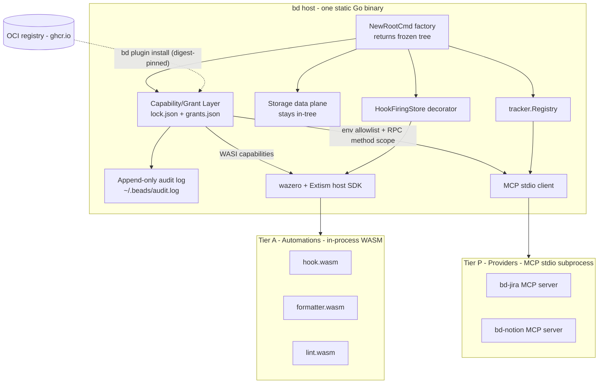

# Plugin System for Beads

> Design document for the beads plugin architecture
> Status: Draft — requesting maintainer feedback
> Date: 2026-05-13
> Companion plan: `~/.cursor/plans/beads-plugin-architecture-4fcfb5bf.plan.md`

## TL;DR

Beads currently bakes six tracker integrations (Jira, Linear, GitHub, GitLab, ADO, Notion — ~15k LOC across `internal/` and `cmd/bd/`) and a hook system directly into the binary. There is no supported way for a third party to add a tracker, hook, or subcommand without forking. This document proposes a **two-tier plugin system** — `Provider` (out-of-process MCP-stdio for trackers) and `Automation` (in-process WASM via wazero for hooks/formatters) — unified by a single **trust layer** (manifest + content-addressed lockfile + first-use capability grants + audit log). Storage stays in-tree (the JSON-RPC overhead is fatal for hot reads). Distribution is via OCI artifacts with mandatory digest pinning.

This proposal has been through two rounds of `council review` (verdict transitioned from Request Changes → LGTM with full multi-reviewer convergence). Sessions: `council-20260513-103022` (initial review) and `council-20260513-104820` (refined design).

## Why now

Three forcing functions:

1. **Maintenance burden.** Six tracker integrations is roughly 15k LOC of API client / mapping / fieldmapping code that we maintain, version, and test in-tree. Each new tracker proposal is currently a 1k-3k LOC PR.
2. **AI-agent fit.** Beads is built for AI-supervised workflows. AI agents want to install integrations on demand, not request a new bd release.
3. **Architectural drift.** We already have five plugin-shaped surfaces in the codebase (`internal/tracker/registry.go` factory map, `internal/hooks/hooks.go` filesystem-script hooks, `integrations/beads-mcp` subprocess pattern, `internal/storage/storage.go` driver seam, `internal/recipes` + `internal/molecules` + `internal/formula` declarative content packs). They each evolved separately. Now is the time to consolidate before adding a seventh.

## Design principles (non-negotiable)

These come out of the council security review. Every later decision flows from these.

1. **No plugin executes without an explicit user grant.** Tier-agnostic. Default-deny. First-use prompt persisted in `~/.beads/plugins/grants.json`.
2. **Every plugin is content-addressed.** SHA-256 digest pinned in `~/.beads/plugins/lock.json`; verified before every launch. No digest = no execution.
3. **Two extension paradigms, no more.** Providers (out-of-process MCP-stdio) and Automations (in-process WASM via wazero). Nothing else.
4. **Storage data plane stays in-tree.** Hot-path reads cannot afford JSON-RPC serialization. Out of scope until a binary-packed driver protocol is justified by data.
5. **Frozen command tree.** `NewRootCmd(...)` returns a fully constructed, immutable `*cobra.Command`. No post-construction registration paths. (Engineering and security property — a compromised dependency cannot silently shadow `bd push`.)
6. **CLI startup overhead must be negligible when no plugins are configured.** SLO: <50 ms cold-start delta vs current binary; <150 ms plugin scan for 100 lockfile entries.
7. **Plugin output flowing into AI agents is wrapped in a provenance envelope.** `{"source": "plugin:bd-jira", "trust": "external", "data": ...}`. Prompt-injection-resistant by construction.

If you push back on any of these, please name the principle by number — they form the spine of the design.

## Architecture



### Tier P: Providers (out-of-process MCP-stdio)

Use for **external service integrations**: trackers (Jira, Linear, etc.) and any future long-lived, schema-rich integration.

- **Wire protocol:** MCP-stdio. Same protocol AI agents already speak; we inherit a marketplace of existing MCP servers and SDKs in TS/Python/Go/Rust/C#.
- **Adapter:** new `internal/tracker/mcp_adapter.go` wraps an MCP client behind the existing [`tracker.IssueTracker`](../../internal/tracker/tracker.go) interface. The registry now has two registration paths: in-tree Go (existing) and discovered MCP plugin (new).
- **Subprocess spawn rules:**
  - **Environment is scrubbed.** Host passes only `PATH`, `HOME`, `LANG`, plus an explicit allowlist declared in the manifest. No accidental `JIRA_TOKEN` / `AWS_*` / `GITHUB_TOKEN` leakage to subprocesses.
  - **Default timeouts** on startup, describe/manifest call, every RPC, and shutdown. Heartbeat for long-lived connections; cancellation propagation; named-plugin timeout errors.
- **Why MCP and not HashiCorp `go-plugin`?** MCP is the protocol agents speak natively. We get free ecosystem reuse. `go-plugin` (gRPC over stdio) remains the obvious upgrade path if we ever need a binary-packed protocol for storage Providers.

### Tier A: Automations (in-process sandboxed WASM)

Use for **lifecycle hooks, formatters, lint rules, content transforms** — anything event-triggered or invoked frequently in-process.

- **Runtime:** wazero (pure Go, CGO-free) plus Extism PDK conventions for polyglot authoring (Rust/Go/JS/Python/C#/Zig).
- **Plugin shape:** single `.wasm` file, typically <1 MB, OS-independent.
- **Host functions:** `bd_get_issue`, `bd_kv_get`, `bd_kv_set`, `bd_log`, `bd_emit_event`. **KV namespaces are scoped per plugin ID** — Automations cannot read each other's state.
- **WASI capabilities** (`fs.read:/path`, `network:host`, etc.) are default-deny. Granted only via manifest + user grant.
- **Replaces** the executable-script `.beads/hooks/on_*` mechanism in [internal/hooks/hooks.go](../../internal/hooks/hooks.go). No silent deprecation period — the executable-script path is gated behind `--allow-unsafe-hooks` with a per-run banner. Default-deny for unsandboxed execution.

### The trust layer (one model, both tiers)

This is the unification that lets us drop implicit PATH discovery entirely.

- **Plugin manifest** (baked into the OCI artifact, supplied alongside local plugins):
  - Stable identity: name, version, content-addressed hash
  - Tier: `provider` or `automation`
  - Capability set: `tracker.read`, `tracker.write`, `network:jira.example.com`, `env:JIRA_TOKEN`, `fs.read:/path`, etc.
- **Lockfile** at `~/.beads/plugins/lock.json` (project-scoped at `.beads/plugins.lock`) — SHA-256 digest of every installed plugin. Verified before every launch. **No digest = no execution.**
- **Grants** at `~/.beads/plugins/grants.json` — per-(plugin identity, capability) user consent. First-use prompt-or-deny (Gatekeeper / Android model).
- **Discovery** is *only* via the lockfile. There is no implicit `bd-*` PATH scan. PATH plugins are not a primary mechanism.
- **Audit log** at `~/.beads/audit.log` (append-only JSONL): every install, update, remove, grant, revoke, execute event. Not writable by plugins.

### Distribution: OCI artifacts

`bd plugin install oci://ghcr.io/owner/bd-jira:v1.2`. Helm 4 standardizes this; ORAS is mature; multi-platform OCI manifests handle os/arch automatically.

- **Digest pinning is mandatory from v0.1.** Tag mutation cannot silently swap a plugin under the user.
- **Cosign signature verification** is opt-in for v0.1 with a visible warning on every invocation of an unsigned plugin (not just on install). Default-required by v1.
- `--insecure` for development only and prints a banner.
- Fallbacks: `bd plugin install gh:owner/bd-jira` and `bd plugin install ./local-folder`.

### Cobra refactor: factory, not exported global

Today, `rootCmd` in [cmd/bd/main.go](../../cmd/bd/main.go) is unexported and subcommand registration happens via package-load `init()` side effects across ~100 files in `cmd/bd/`. **No third party can add a subcommand without forking.**

Proposal: `NewRootCmd(registry PluginRegistry, deps ...) *cobra.Command`. Dependencies injected explicitly. Plugin subcommands resolved at construction. The returned tree is **frozen** — no further registration after construction completes.

Migration is mechanical: collapse each `cmd/bd/*.go` `init()` into an explicit constructor function called by `NewRootCmd`. No behavior change. All existing tests pass unchanged.

## Measurable success criteria (CI-enforced)

These are the council's quantified gates. Benchmarks fail the build if any regress.

- Cold-start overhead with no plugins: under +50 ms vs current `bd` binary
- Plugin scan time for 100 lockfile entries: under 150 ms
- MCP tracker fetch p95 overhead vs in-tree call: under +50 ms
- WASM module instantiation memory footprint: under 5 MB per instance
- `cobra` help-text rendering: zero degradation
- Plugin install success rate: above 95%
- Crash-free CLI sessions: above 99%
- **Notion MCP plugin parity:** zero regressions against existing [internal/notion](../../internal/notion) and [cmd/bd/notion_test.go](../../cmd/bd/notion_test.go) test suite
- Trust enforcement: 100% of installed plugins have pinned digests; 0 plugin executions without a recorded grant
- Subprocess startup timeout: under 2 s

## Migration: smallest credible slice

Validate the architecture with one concrete pilot rather than refactoring everything at once.

1. **`NewRootCmd` factory + frozen tree.** Mechanical refactor. No behavior change. Unblocks everything.
2. **Trust layer plumbing.** Manifest schema + `lock.json` + `grants.json` + audit log + `bd plugin {install,list,remove,trust,audit,doctor}` subcommands. Implement before any actual plugins ship so the trust path is never optional.
3. **MCP Provider adapter.** New file `internal/tracker/mcp_adapter.go` satisfies `tracker.IssueTracker` by wrapping an MCP stdio client. Defines capability schema, env allowlist enforcement, timeouts/heartbeats, provenance envelope on output.
4. **Notion pilot.** Extract Notion (~1.7k LOC + ~613 LOC CLI) into `bd-notion` MCP server (its own repo, or `integrations/bd-notion/`). The existing [internal/notion](../../internal/notion) implementation stays as a fallback gated behind `--allow-builtin-fallback`, with an explicit removal milestone (see debt register below). Existing tests are the regression suite, unchanged.
5. **WASM Automation runtime.** wazero + Extism host SDK in `internal/automations/` plus per-plugin KV-namespacing host functions, plus the `--allow-unsafe-hooks` gate around the legacy executable-script path.
6. **SLO benchmark gates** in CI from day one.

The five other bundled trackers (Jira, Linear, GitHub, GitLab, ADO) stay in-tree through v1 to avoid forcing six install commands on new users.

## Migration debt register

Every transitional path has an owner placeholder and a removal milestone. Expired fallbacks are treated as defects, not trade-offs.

- **In-tree Notion tracker** — gated behind `--allow-builtin-fallback`. Removal: pilot + 2 minor releases. Removal criteria: MCP plugin install >95% success, parity tests green, plugin published to OCI registry with digest pin.
- **Executable-script lifecycle hooks** — gated behind `--allow-unsafe-hooks` with per-run visible warning. Removal: WASM Automation runtime ships + 1 minor release. Removal criteria: WASM hook authoring docs published, migration tool (`bd plugin migrate-hook`) works on common scripts.
- **`init()`-based command registration** — fully removed by the factory refactor. No fallback period.
- **In-tree Jira/Linear/GitHub/GitLab/ADO trackers** — bundled by default for the v1 plugin era. Removal milestone: v2. Removal criteria: corresponding MCP plugins each pass their own pilot success bar.

## What is not a plugin

Three explicit non-goals so reviewers don't have to ask.

- **Storage backends.** [internal/storage/storage.go](../../internal/storage/storage.go) is the documented driver boundary (see [AGENTS.md](../../AGENTS.md) "Storage Boundary"). It stays in-tree. JSON-RPC over stdio is unsuitable for hot data-plane reads. Reconsider only with a binary-packed driver protocol (gRPC + protobuf via `go-plugin`, or shared-memory WASM).
- **Recipes / molecules / formulas.** Stay as declarative content packs in [internal/recipes](../../internal/recipes), [internal/molecules](../../internal/molecules), [internal/formula](../../internal/formula). Hierarchical built-in + user override loading already works. Not a third paradigm.
- **The Cobra command tree.** Frozen after construction. Plugins contribute commands during construction; nothing can mutate the tree at runtime. (This is a security property as much as an engineering one.)

## Specific feedback I'm asking for

Order of preference, but please answer any subset.

1. **Storage non-goal.** Are we sure storage stays in-tree forever, or do we need a "future Storage Provider via gRPC + `go-plugin`" carve-out in v1 docs? (Right now the plan punts entirely.)
2. **Bundled-by-default vs plugin-from-day-one.** Plan recommends bundling Jira/Linear/GitHub/GitLab/ADO through v1, removing in v2. Is that ratio right, or should we drop two of the five sooner to reduce binary size?
3. **Hook breaking change appetite.** Plan is aggressive: executable-script hooks become opt-in via `--allow-unsafe-hooks` immediately when WASM ships, with a per-run banner. Alternative: silent grace period across two releases. Council security strongly preferred the aggressive path. How loudly will users complain?
4. **Naming.** `provider` for Tier P, `automation` for Tier A, `plugin` as umbrella, retire `extension` (the deprecated in-process Go SDK story in [examples/bd-example-extension-go/](../../examples/bd-example-extension-go/)). Acceptable, or do you want different vocabulary?
5. **Distribution channel.** OCI mandatory pinning + cosign opt-in for v0.1, default-required by v1. Or do we want cosign required from day one? (Tradeoff: friction for hobbyist plugin authors.)
6. **Hosted plugin index.** Worth shipping a curated index in v1, or push that to v1.x? `bd plugin search` only works against an index.
7. **Provenance envelope.** Should `bd --json` always wrap plugin output in `{"source": "plugin:X", "trust": "external", "data": ...}`, or only when invoked under MCP? Plan recommends always-wrap; cost is negligible and consumers can unwrap.
8. **Quickstart UX.** Should `bd plugin quickstart` be a built-in subcommand or itself shipped as the first sample plugin (dogfooding)?

## Open risks I'd like another set of eyes on

- **Subprocess startup amortization.** A cold `bd jira sync` invocation now pays a Node/Python/whatever startup tax (~100-300 ms) that the in-tree Go path avoids. The 50 ms p95 SLO assumes warm subprocesses; cold-start path needs measurement during the Notion pilot.
- **Windows.** wazero handles Windows fine. MCP-stdio subprocess plugins work fine. But the hook-replacement story for users currently using `.bat` files in `.beads/hooks/` needs a real migration plan, not just `--allow-unsafe-hooks`.
- **CGO-free invariant.** wazero preserves it. Extism's host SDK does not require CGO. But anyone who proposes a different WASM runtime (wasmtime-go, wasmer) breaks our static-binary distribution. We need an ADR locking this in.
- **Notion as the pilot.** Notion is the smallest tracker (~1.7k LOC) and the newest, but its API has the most idiosyncratic field model. Linear or GitHub might be a more honest stress test of the MCP capability surface. Argue the case if you disagree.
- **MCP version negotiation.** The MCP protocol is still moving (revisions 2024-11-05 → 2025-06-18 → ...). We need explicit `protocol_version` in the manifest plus host-side compatibility logic, otherwise old plugins break on `bd` upgrade. Plan mentions this; doesn't fully spec it.
- **AI prompt injection via plugin output.** Provenance envelope helps but doesn't prevent. Worth a separate threat model doc once a hostile MCP server has been demonstrated against `integrations/beads-mcp` in the wild.

## Alternatives considered (rejected)

Brief honest list so you don't have to ask.

- **Native Go `plugin` package** — non-starter. No Windows. Requires CGO. Version-locked. Kills static-binary distribution.
- **Embedded scripting (Starlark, Lua, JS)** — dropped after first council pass. WASM subsumes the use case while preserving sandboxing and not adding a third paradigm.
- **HashiCorp `go-plugin` (gRPC)** — viable for Tier P. Rejected only because MCP gives us free agent ecosystem reuse. Kept on the shelf for a future Storage Provider.
- **Implicit PATH discovery (`git`/`gh`/`kubectl` style)** — rejected as a primary mechanism after security review. PATH hijack is a trivial arbitrary-code-exec vector for a CLI that handles tracker tokens. PATH plugins still work via explicit `bd plugin install ./local-folder`.
- **Caddy `xcaddy`-style hosted build service** — interesting future option for enterprise environments that want zero runtime plugin surface. Not in scope for v0.1.
- **Yaegi (Traefik-style embedded Go interpreter)** — interesting escape hatch for "I want a hook in 30 lines of Go without a build step." Not in scope for v0.1.
- **HTTP/webhook plugins (Backstage style)** — wrong shape for a local CLI used by individual agents.

## References

- Companion plan with full background and todos: `~/.cursor/plans/beads-plugin-architecture-4fcfb5bf.plan.md`
- Council review session (initial, Request Changes): `council-20260513-103022`
- Council suggest session (refined, LGTM): `council-20260513-104820`
- Storage boundary policy: [AGENTS.md](../../AGENTS.md) section "Storage Boundary"
- Existing tracker registry pattern: [internal/tracker/registry.go](../../internal/tracker/registry.go), [internal/tracker/tracker.go](../../internal/tracker/tracker.go)
- Existing hook system: [internal/hooks/hooks.go](../../internal/hooks/hooks.go), [internal/storage/hook_decorator.go](../../internal/storage/hook_decorator.go)
- Existing subprocess-bd integration: [integrations/beads-mcp/src/beads_mcp/bd_client.py](../../integrations/beads-mcp/src/beads_mcp/bd_client.py)
- Deprecated in-process Go SDK example: [examples/bd-example-extension-go/README.md](../../examples/bd-example-extension-go/README.md)
- wazero: <https://wazero.io>
- Extism: <https://extism.org>
- MCP spec: <https://modelcontextprotocol.io>

## Appendix: file layout the design produces

```
~/.beads/
  plugins/
    lock.json                # SHA-256 digests of every installed plugin
    grants.json              # per-(plugin, capability) user consent
    cache/
      bd-jira/
        manifest.json
        bd-jira              # subprocess binary
      bd-needs-review-gate/
        manifest.json
        plugin.wasm
  audit.log                  # append-only JSONL of every install/grant/exec event
```

Project-scoped overlays at `.beads/plugins.lock` so teams pin shared plugins per repo.
